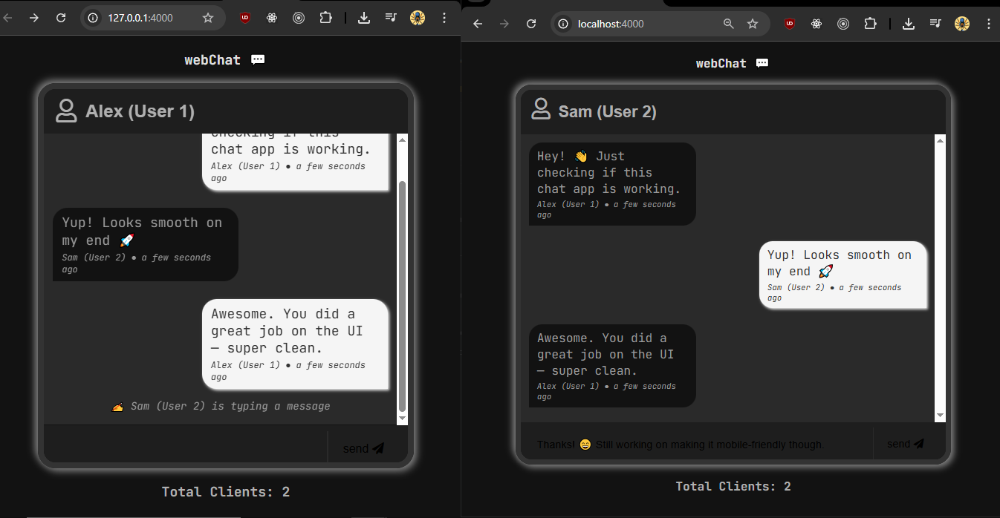

# webChat (A chat app).



Simple chat app made using websockets (Nodejs, Express & Socket.io).

---

## What is Websocket ?

WebSockets are an alternative to HTTP communication in Web Application, they offer full-duplex communication, that is, it is, bi-directional and that means the data can flow in both ways, so it can flow from client to the server and also from server to the client.

---

## To start setting up the project

Step 1: Clone the repo

```bash
git clone https://github.com/Ashutosh-88/chat-socket.io.git
```

Step 2: cd into the cloned repo and run:

```bash
npm install
```

Step 3: Start the chat app (development mode)

```bash
npm run dev
```

Step 4: Start the chat app

```bash
npm start
```

## Author

- [**Ashutosh-88**](https://www.linkedin.com/in/ashutosh-tiwari-70b504190/)
